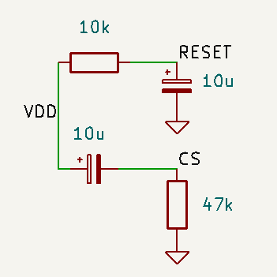

# Display_OpenScape_DECT_Phone_SL5
 Display OpenScape DECT Phone SL5. Pinout and Init
 
 1  LED+ 9V
 
 2  LED-
 
 3  VDD 2,9V
 
 4  GND
 
 5  RESET
 
 6  CS
 
 7  CLK
 
 8  C/D
 
 9  SDA
 
 10 VDDI 1,8V
 
 
 
 
 
 
 If you need save pins
 
 
